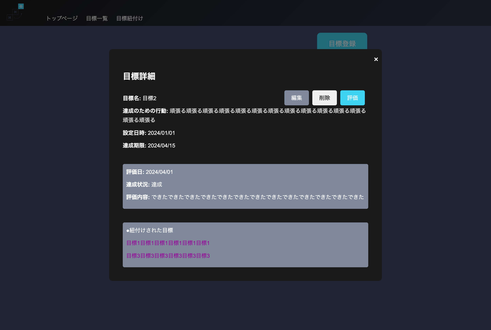
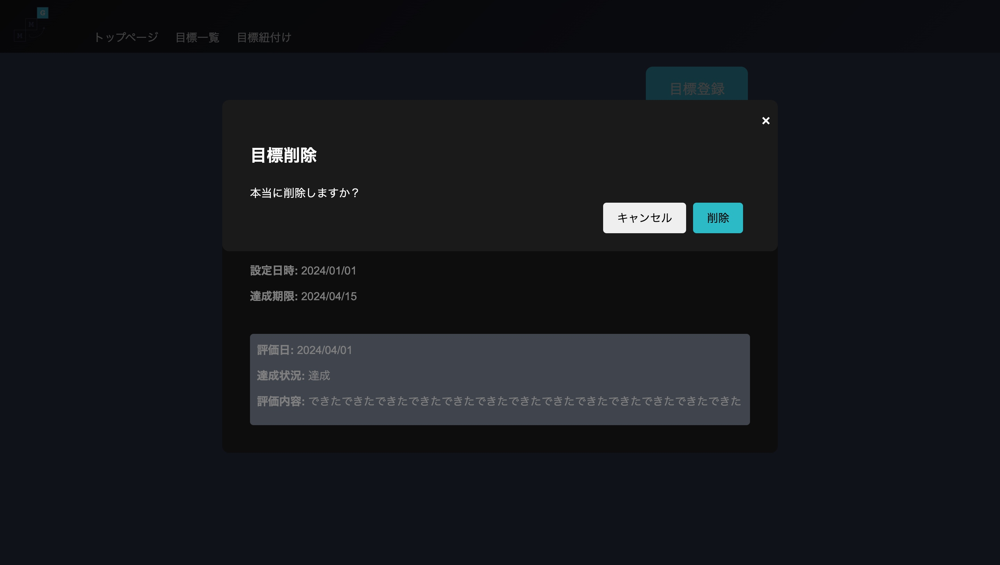

|ID|画面名|URL|
|----|----|----|
|MMG-3-01|目標詳細モーダル|-|

## レイアウト



## 項目一覧
|No|項目名|種類|必須|文字数|文字種|出力|物理名|イベント|画面遷移|補足|
|----|----|----|----|----|----|----|----|----|----|----|
||モーダルタイトル|テキスト|-|-|-|-|-|-|-|-|
||編集ボタン|ボタン|-|-|-|-|-|-|MMG-3-02_目標詳細モーダル(編集モード)|モーダル内のオブジェクトが入れ変わる|
||削除ボタン|ボタン|-|-|-|-|-|-|-|元画面を維持してモーダル起動。|
||評価ボタン|ボタン|-|-|-|-|-|-|MMG-4-01_目標評価画面|評価画面のURLに/{goal.goal_id}を付与して遷移する|
||目標タイトル|テキスト|-|-|-|goal.goal_title|-|-|-|-|
||達成のための行動|テキスト|-|-|-|goal.action|-|-|-|-|
||設定日時|テキスト|-|-|-|goal.created_at|-|-|-|-|
||達成期限|テキスト|-|-|-|goal.deadline|-|-|-|-|達成期限が切れている場合は赤文字|
||評価日|テキスト|-|-|-|goal.evaluationed_at|-|-|-|statusが進行中の場合は非表示|
||達成状況|テキスト|-|-|-|goal.status|-|-|-|statusが進行中の場合は非表示|
||評価内容|テキスト|-|-|-|goal.evaluation|-|-|-|statusが進行中の場合は非表示|
||紐付けされた目標|リンク|-|-|-|linked_goal.goal_title|-|-|モーダルの表示をに切り替える|linked_goal.goal_id_01や02でモーダルの内容を切り替える<br>linked_goal.goal_id_01 == goal_idの場合はlinked_goal.goal_id_02、逆の場合はlinked_goal.goal_id_01を遷移先にする|
||キャンセルボタン(削除モーダル内)|ボタン|-|-|-|-|-|-|-|削除モーダルを閉じる|
||削除ボタン(削除モーダル内)|ボタン|-|-|-|-|-|E-06|-|-|


## イベント一覧
### E-06 目標削除
1. `goal_id`に一致するレコードを論理削除する
    ```SQL
    UPDATE goals
    SET del_flg = 1,
        updated_at = NOW()
    WHERE goal_id = {goal_id};
    ```

2. レコードの更新に成功したらTrue,それ以外はFalseを返却する
    1. 返却値がTrue:成功の場合
        * 画面をリロードし、削除に成功したメッセージを表示する
        * `目標を削除しました`
    2. False:失敗の場合
        * 予期せぬエラーが発生したメッセージを表示する
        * `予期せぬエラーが発生しました`
3. 処理終了