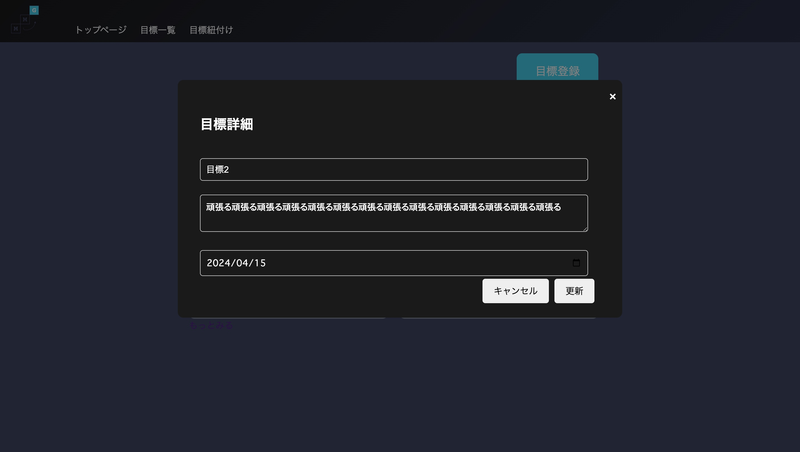

|ID|画面名|URL|
|----|----|----|
|MMG-3-01|目標詳細モーダル(編集画面)|-|

## レイアウト


## 項目一覧
|No|項目名|種類|必須|文字数|文字種|出力|物理名|イベント|画面遷移|補足|
|----|----|----|----|----|----|----|----|----|----|----|
||モーダルタイトル|テキスト|-|-|-|-|-|-|-|-|
||目標タイトル|テキストボックス|○|100|-|goal.goal_title|goal_title|-|-|-|
||達成のための行動|テキストボックス|○|999|-|goal.action|action|-|-|-|
||達成期限|日付選択|○|-|-|goal.deadline|deadline|-|-|-|-|
||キャンセルボタン|ボタン|-|-|-|-|-|-|MMG-3-01_目標詳細モーダル|モーダル内のオブジェクトが入れ替わる|
||更新ボタン|ボタン|-|-|-|-|-|E-05|-|-|


## イベント一覧
### E-05 目標削除
1. 必須項目チェック
    * 未入力項目がある場合、テキストボックス上に赤文字でアラートを表示する。
    * `必須項目です`
2. 登録を実施
    1. `goal_id`に`goal.goal_id`を格納する
    2. SQLを実施
        ```SQL
        UPDATE SET goals 
            goal_title = '{goal_title}',
            action = '{action}',
            deadline = '{deadline}',
            updated_at = NOW()
        WHERE goal_id = {'goal_id'}
        ```
    2. レコードの作成に成功したらTrue,それ以外はFalseを返却する
        1. 返却値がTrue:成功の場合
            * モーダル内の表示をMMG-3-01_目標詳細モーダルに切り替え、編集に成功したメッセージを表示する
            * `目標を編集しました`
        2. False:失敗の場合
            * 予期せぬエラーが発生したメッセージを表示する
            * `予期せぬエラーが発生しました`
3. 処理終了