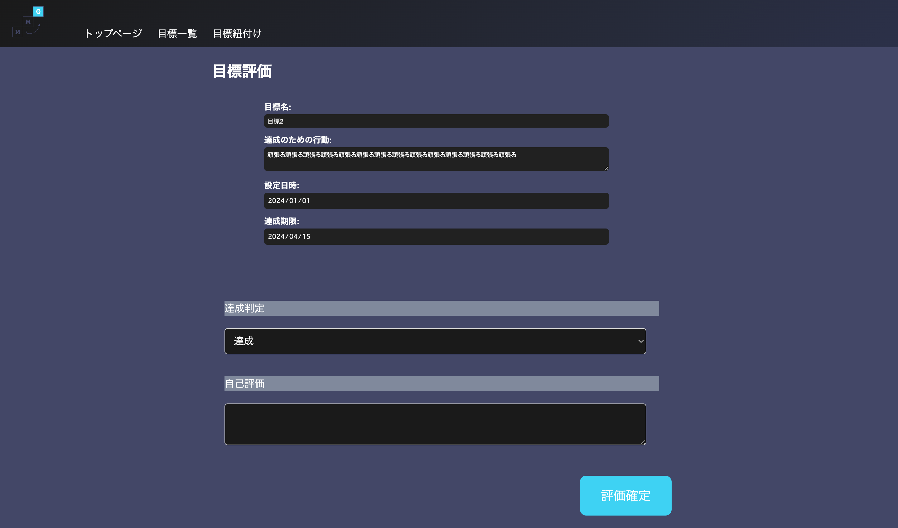

|ID|画面名|URL|
|----|----|----|
|MMG-4-01|目標評価画面|/evaluation_goal/{goal_id)|

## レイアウト



## 項目一覧
|No|項目名|種類|必須|文字数|文字種|出力|物理名|イベント|画面遷移|補足|
|----|----|----|----|----|----|----|----|----|----|----|
||画面タイトル|テキスト|-|-|-|-|-|-|-|-|
||目標タイトル|テキスト|-|-|-|goal.goal_title|-|-|-|-|
||達成のための行動|テキスト|-|-|-|goal.action|-|-|-|-|
||設定日時|テキスト|-|-|-|goal.created_at|-|-|-|-|
||達成期限|テキスト|-|-|-|goal.deadline|-|-|-|-|-|
||達成状況|プルダウン|○|-|-|-|status|-|-|-|
||評価内容|テキスト|○|999|-|-|evaluation|-|-|-|
||評価確定ボタン|ボタン|-|-|-|-|-|E-09|-|-|
||はいボタン(評価完了モーダル内)|ボタン|-|-|-|-|-|-|MMG-4-02_後続目標登録画面|後続目標登録画面のURLに/{goal_id}を付与して遷移する|
||いいえボタン(評価完了モーダル内)|ボタン|-|-|-|-|-|-|MMG-2-03_目標一覧画面|-|


## イベント一覧
### E-00 初期表示
1. ログイン認証
    * 共通処理のログイン認証を呼び出す
        1. 認証結果がFalseの場合
            * ログイン画面にリダイレクトする
        2. 認証結果がTrueの場合
            * 2の処理に進む
2. E-04 目標詳細取得を呼び出す
3. 処理終了

### E-04 目標詳細取得
1. `goal_id`にURLの`{goal_id}`を格納する
2. DBから`goal_id`に一致するレコードを取得する
    ```SQL
    SELECT goal_id,goal_title,action,deadline,created_at,status,evaluation,evaluationed_at
    FROM goals
    WHERE goal_id = '{goal_id}'
    ```
3. 処理結果を辞書型リスト`goal=[]`に格納し返却する
4. 処理終了


### E-09 評価確定
1. 必須項目チェック
    * 未入力項目がある場合、テキストボックス上に赤文字でアラートを表示する。
    * `必須項目です`
2. 登録を実施
    1. `goal_id`にURLの`{goal_id}`を格納する
    2. SQLを実施
        ```SQL
        UPDATE SET goals 
            status = '{status}',
            evaluation = '{evaluation}',
            evaluationed_at = NOW(),
            updated_at = NOW()
        WHERE goal_id = {'goal_id'}
        ```
    2. レコードの作成に成功したらTrue,それ以外はFalseを返却する
        1. 返却値がTrue:成功の場合
            * 評価確定モーダルを表示する
        2. False:失敗の場合
            * 予期せぬエラーが発生したメッセージを表示する
            * `予期せぬエラーが発生しました`
3. 処理終了