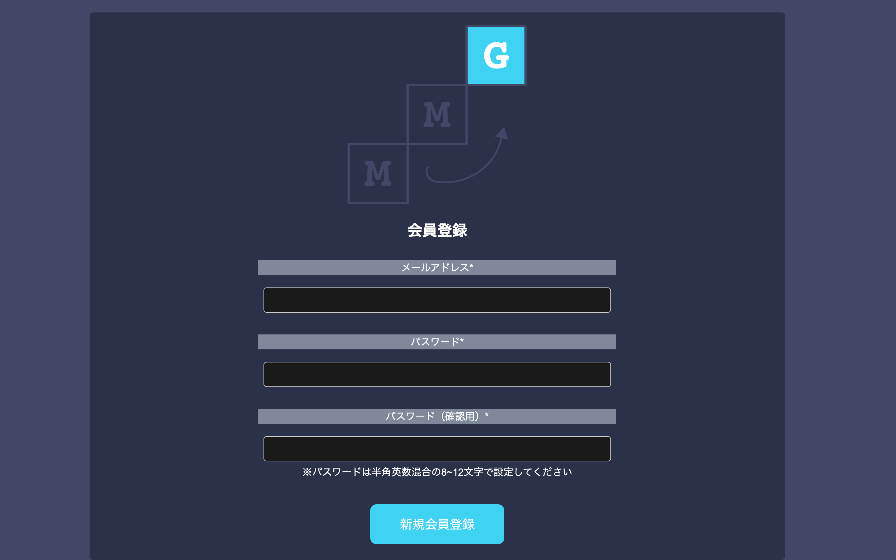
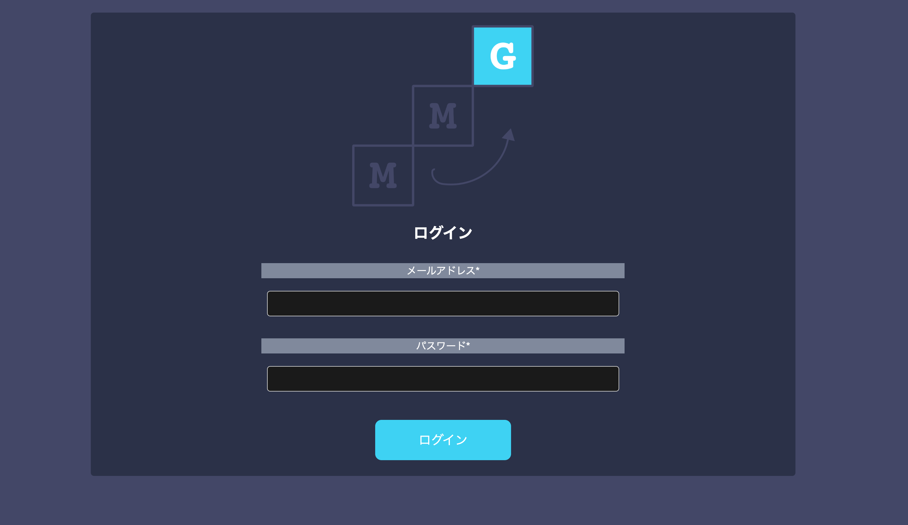
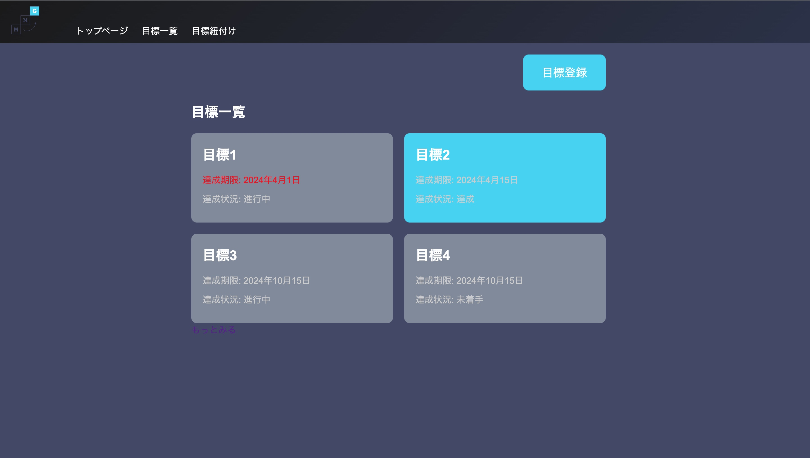
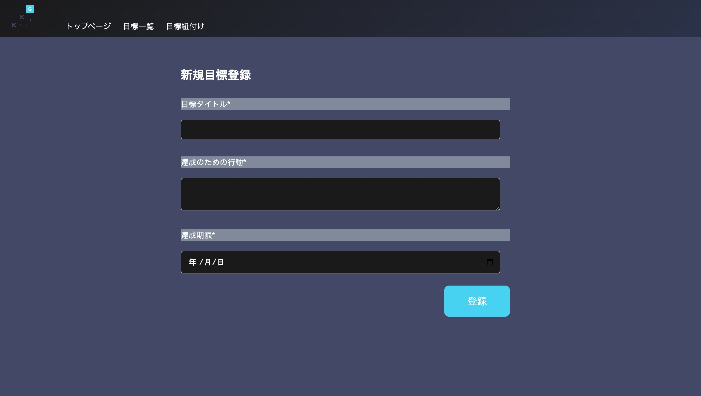
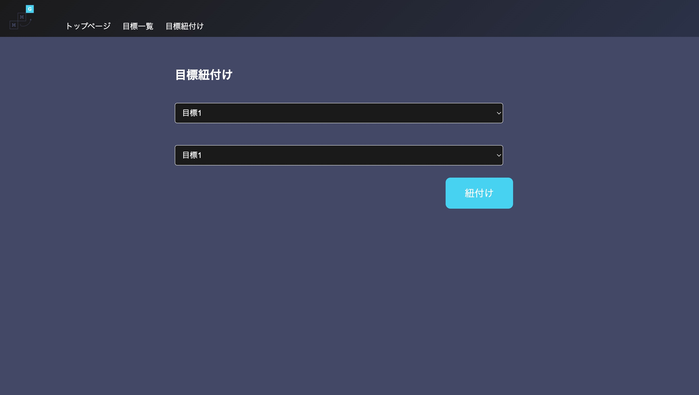
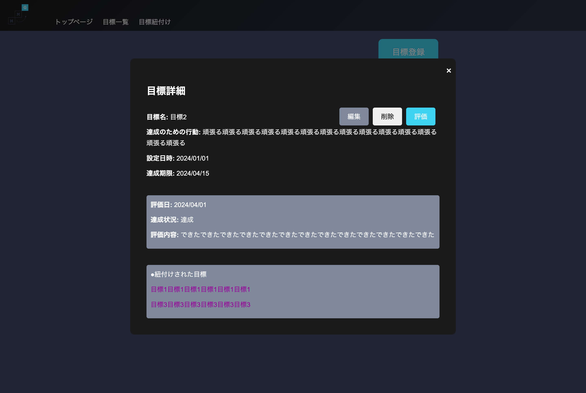
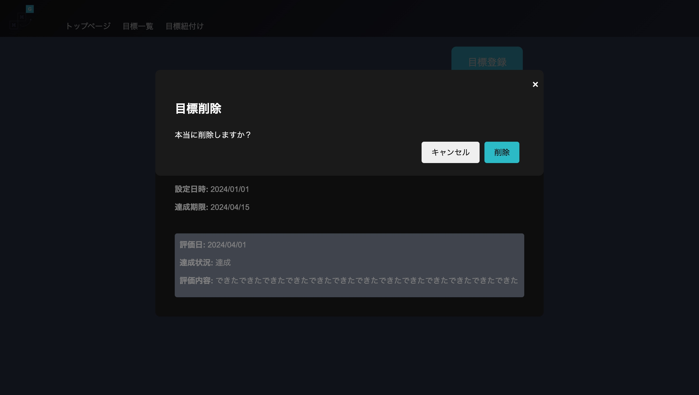
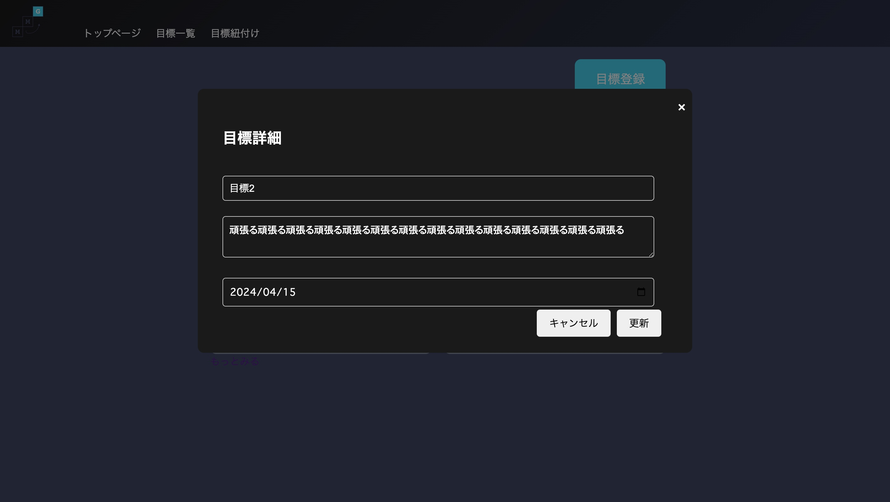
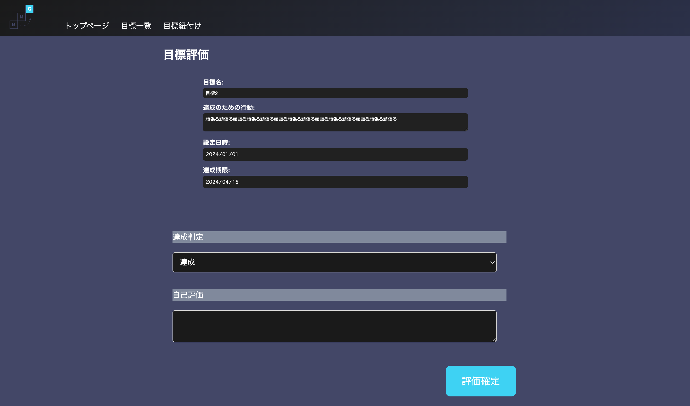
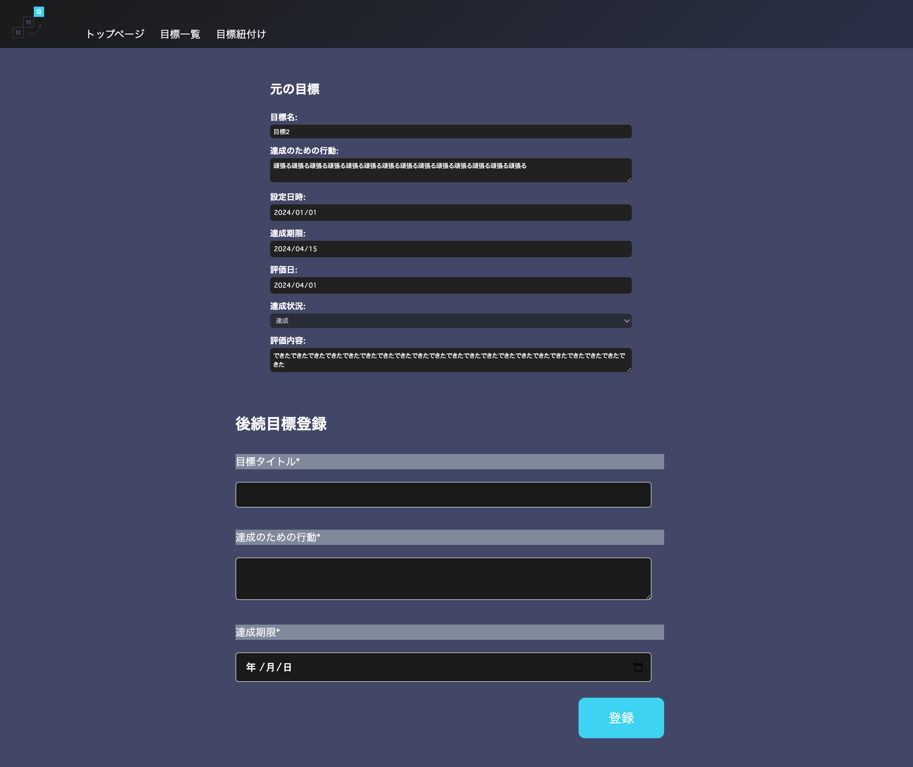

# 画面一覧
|No|画面名|画面ID|説明|
|----|----|----|----|
|1|会員登録画面|MMG-1-01|メールアドレスとパスワードを入力して会員登録を実施する 入力した形式に問題がある場合はアラートを表示|
|2|ログイン画面|MMG-1-02|メールアドレスとパスワードを入力してログインする どちらかが間違っている場合はアラートを表示|
|3|トップページ|MMG-1-03|新規目標登録への導線と、ログインユーザーの登録済み目標五件を表示する|
|4|新規目標登録画面|MMG-2-01|各入力項目を備え、新規の目標を登録できる|
|5|目標紐付け画面|MMG-2-02|プルダウンで二つの登録済み目標を選択し、紐付けできる|
|6|目標一覧画面|MMG-2-03|ログインユーザーの登録済み目標を全て表示する ソートおよびフィルターが可能|
|7|目標詳細モーダル|MMG-3-01|目標一覧画面から起動するモーダル 登録時に入力した内容を全て表示する 評価、編集への導線を設置する|
|8|目標詳細モーダル（編集モード）|MMG-3-02|各入力項目を編集することができる|
|9|目標評価画面|MMG-4-01|目標の達成状況と自己評価分を登録できる|
|10|後続目標登録画面|MMG-4-02|目標の評価完了から遷移する 評価済み目標の内容と、新規目標登録の入力項目が表示される|

# レイアウト
## MMG-1-01 会員登録画面

## MMG-1-02 ログイン画面

## MMG-1-03 トップページ

## MMG-2-01 新規目標登録画面

## MMG-2-02 目標紐付け画面

## MMG-2-03 目標一覧画面

## MMG-3-01 目標詳細モーダル

## MMG-3-02 目標詳細モーダル（編集モード）

## MMG-4-01 目標評価画面

## MMG-4-02 後続目標登録画面
