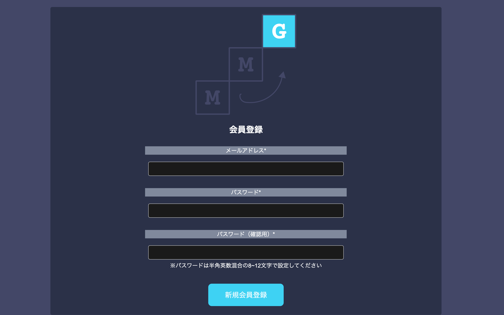

|ID|画面名|URL|
|----|----|----|
|MMG-1-01|会員登録画面|/user_registration|

## レイアウト


## 項目一覧
|No|項目名|種類|必須|文字数|文字種|出力|物理名|イベント|画面遷移|補足|
|----|----|----|----|----|----|----|----|----|----|----|
||ロゴ|画像|-|-|-|-|-|-|-|-|
||画面タイトル|テキスト|-|-|-|-|-|-|-|-|
||メールアドレス|テキストボックス|○|~255|メールアドレス形式|-|email|-|-|-|
||パスワード|テキストボックス|○|8~12|半角英数混合|-|password|-|-|-|
||パスワード(確認用)|テキストボックス|○|8~12|半角英数混合|-|password_check|-|-|-|
||注意文|テキスト|-|-|-|-|-|-|-|-|
||会員登録ボタン|ボタン||-|-|-|-|E-01|-|-|-|

## イベント一覧
### E-01 会員登録
1. フロントでの各種チェック
    1. 必須項目チェック
        * 未入力項目がある場合、テキストボックス上に赤文字でアラートを表示する。
        * `必須項目です`
    2. メールアドレス形式チェック
        * メールアドレスの形式が不正だった場合、テキストボックス上に赤文字でアラートを表示する。
        * `メールアドレスの形式が正しくありません`
    3. パスワードの一致チェック
        * パスワードとパスワード(確認用)の入力内容が一致していない場合、テキストボックス上に赤文字でアラートを表示する。
        * `パスワードが一致しません`
    4. パスワードの形式チェック
        * パスワードが8~12文字の英数混合でない場合、テキストボックス上に赤文字でアラートを表示する。
        * `パスワードは8~12文字の半角英数混合で入力してください`
2. 既存会員とのメールアドレス重複チェック
    1. 入力したメールアドレスをDBに照会し、存在有無を確認する
        ```SQL
        SELECT COUNT(*) FROM users 
        WHERE mail_address = '{mail_address}' and del_flg = 0;
        ```
    2. 既に使われている(SQLの結果が1以上)場合、テキストボックス上に赤文字でアラートを表示して処理を終了する
    * `このメールアドレスは既に使われています`
    3. 使われていない場合、3の処理に進む
3. 会員登録を実施
    1. 新規会員をDBに追加する
        ```SQL
        INSERT INTO users (
            email, 
            password, 
            created_at, 
            updated_at
        ) 
        VALUES (
            '{email}',
            SHA2('{password}', 256),
            NOW(), 
            NOW()
        );
        ```
    2. レコードの作成に成功したらTrue,それ以外はFalseを返却する
        1. 返却値がTrue:成功の場合
            * MMG-1-02_ログイン画面に遷移し、会員登録に成功したメッセージを表示する
            * `会員登録に成功しました`
        2. False:失敗の場合
            * 予期せぬエラーが発生したメッセージを表示する
            * `予期せぬエラーが発生しました`
4. 処理終了